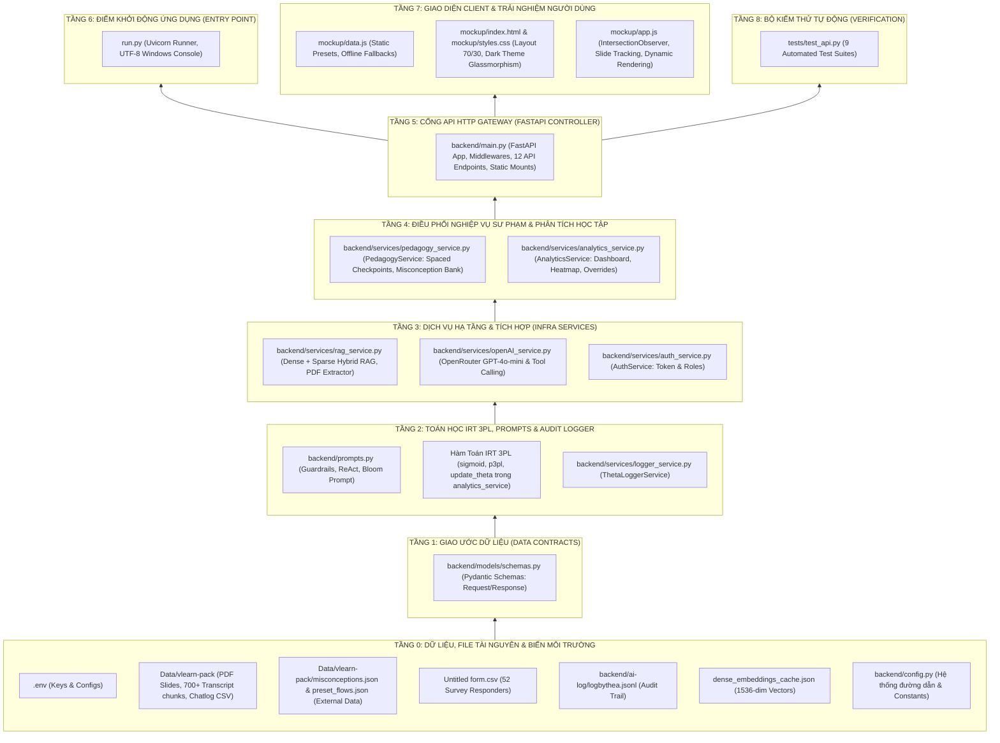
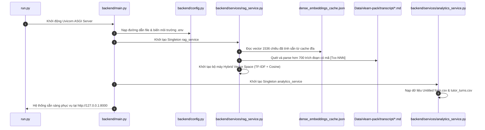
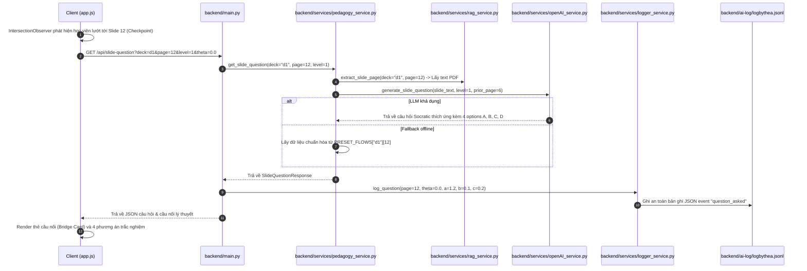
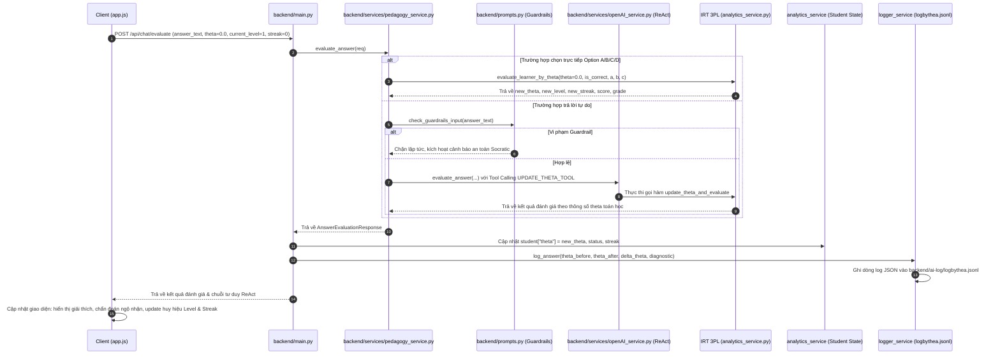
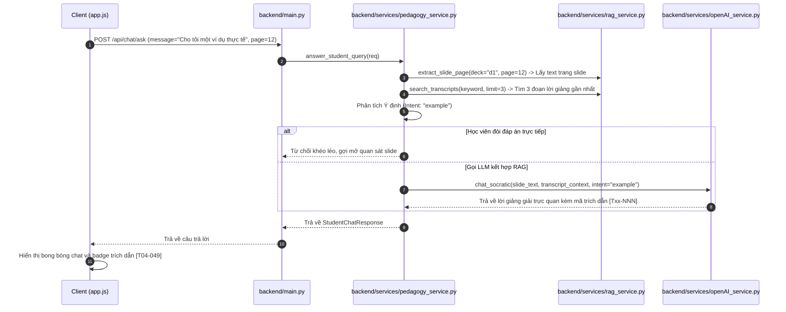
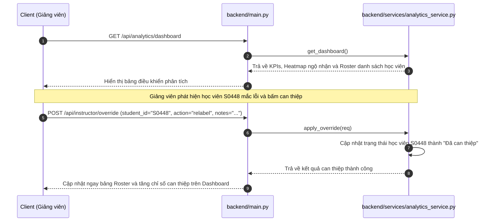
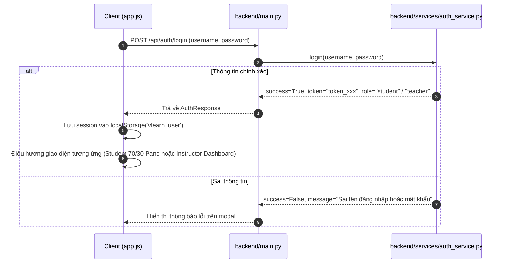

# BẢN ĐỒ KIẾN TRÚC & WORKFLOW DỰ ÁN VLEARN ADAPTIVE AI TUTOR (BÉTBÉTBÉT)
> **Tài liệu phân tích kiến trúc mã nguồn và luồng thực thi toàn diện theo thứ tự từ dưới lên (Bottom-Up Approach).**

---

## MỤC LỤC TỔNG QUAN

1. [Giới thiệu & Triết lý Thiết kế Hệ thống](#1-giới-thiệu--triết-lý-thiết-kế-hệ-thống)
2. [Sơ đồ Phân tầng Kiến trúc Từ Dưới Lên (Bottom-Up Hierarchy)](#2-sơ-đồ-phân-tầng-kiến-trúc-từ-dưới-lên-bottom-up-hierarchy)
3. [Chi tiết Từng Tầng: Từng File, Hàm và Nhiệm vụ Cụ thể](#3-chi-tiết-từng-tầng-từng-file-hàm-và-nhiệm-vụ-cụ-thể)
   - [Tầng 0: Tầng Dữ liệu, Tài nguyên & Cấu hình Hệ thống (Data & Config Layer)](#tầng-0-tầng-dữ-liệu-tài-nguyên--cấu-hình-hệ-thống-data--config-layer)
   - [Tầng 1: Tầng Giao ước Dữ liệu (Schemas / Data Contracts Layer)](#tầng-1-tầng-giao-ước-dữ-liệu-schemas--data-contracts-layer)
   - [Tầng 2: Tầng Toán học IRT 3PL, Prompt Engineering & Ghi vết Theta (Core Algorithmic Foundations)](#tầng-2-tầng-toán-học-irt-3pl-prompt-engineering--ghi-vết-theta-core-algorithmic-foundations)
   - [Tầng 3: Tầng Dịch vụ Kỹ thuật & Tích hợp (Specialized Infrastructure Services)](#tầng-3-tầng-dịch-vụ-kỹ-thuật--tích-hợp-specialized-infrastructure-services)
   - [Tầng 4: Tầng Nghiệp vụ Sư phạm & Phân tích Học tập (Domain Logic Orchestration)](#tầng-4-tầng-nghiệp-vụ-sư-phạm--phân-tích-học-tập-domain-logic-orchestration)
   - [Tầng 5: Tầng API Gateway & HTTP Routing (FastAPI Controllers)](#tầng-5-tầng-api-gateway--http-routing-fastapi-controllers)
   - [Tầng 6: Tầng Điểm khởi động Ứng dụng (Launcher & Entry Point)](#tầng-6-tầng-điểm-khởi-động-ứng-dụng-launcher--entry-point)
   - [Tầng 7: Tầng Trình diễn & Trải nghiệm Người dùng (Frontend Presentation Layer)](#tầng-7-tầng-trình-diễn--trải-nghiệm-người-dùng-frontend-presentation-layer)
   - [Tầng 8: Tầng Kiểm thử Tự động (Verification & Test Suite)](#tầng-8-tầng-kiểm-thử-tự-động-verification--test-suite)
4. [Các Luồng Nghiệp vụ Thời gian thực (Runtime End-to-End Workflows)](#4-các-luồng-nghiệp-vụ-thời-gian-thực-runtime-end-to-end-workflows)
   - [Luồng 1: Bootstrapping & Khởi tạo Vector Space (Khởi động hệ thống)](#luồng-1-bootstrapping--khởi-tạo-vector-space-khởi-động-hệ-thống)
   - [Luồng 2: Điều hướng Slide & Kích hoạt Câu hỏi Socratic Thích ứng](#luồng-2-điều-hướng-slide--kích-hoạt-câu-hỏi-socratic-thích-ứng)
   - [Luồng 3: Đánh giá Câu trả lời Học viên & Cập nhật Năng lực Theta (IRT 3PL)](#luồng-3-đánh-giá-câu-trả-lời-học-viên--cập-nhật-năng-lực-theta-irt-3pl)
   - [Luồng 4: Trợ lý Đàm thoại Socratic Đồng hành (Hybrid RAG Chat)](#luồng-4-trợ-lý-đàm-thoại-socratic-đồng-hành-hybrid-rag-chat)
   - [Luồng 5: Dashboard Giảng viên & Can thiệp Thủ công (Override)](#luồng-5-dashboard-giảng-viên--can-thiệp-thủ-công-override)
   - [Luồng 6: Xác thực & Phân quyền Người dùng (Authentication)](#luồng-6-xác-thực--phân-quyền-người-dùng-authentication)
5. [Bảng Ma trận Phụ thuộc Giữa các File (Dependency Matrix)](#5-bảng-ma-trận-phụ-thuộc-giữa-các-file-dependency-matrix)
6. [Tóm tắt Giá trị Kỹ thuật Đột phá](#6-tóm-tắt-giá-trị-kỹ-thuật-đột-phá)

---

## 1. GIỚI THIỆU & TRIẾT LÝ THIẾT KẾ HỆ THỐNG

Dự án **VLearn Adaptive AI Tutor** (mã hiệu dự án: **BétBétBét**, Track D) giải quyết bài toán cốt lõi trong giáo dục trực tuyến: **Người học đọc slide bài giảng nhưng thụ động một chiều, không áp dụng được vào thực tế và thường mắc các lỗi ngộ nhận (misconceptions) kinh điển mà không tự nhận biết.**

### 3 Nguyên tắc Thiết kế Cốt lõi:
1. **Socratic Scaffolding & Productive Failure:** Không bao giờ giải hộ hay đưa đáp án trần cho học sinh; luôn đặt câu hỏi gợi mở, bắc cầu kiến thức (Theory Bridging) từ slide cũ sang slide mới và khích lệ tư duy phản biện.
2. **IRT 3PL Theta Mathematical Assessment (Không để LLM cảm tính):** Năng lực học viên ($\theta$), độ khó câu hỏi ($b$), độ phân biệt ($a$), và xác suất đoán mò ($c$) được tính toán bằng mô hình toán học Item Response Theory 3-Tham số. Mọi thăng cấp (Level 1, 2, 3), chấm điểm, và phát hiện ngộ nhận đều được kiểm soát chặt chẽ bởi thông số toán này.
3. **Hybrid RAG & High-Resolution Visual Grounding:** Kết hợp tìm kiếm ngữ nghĩa Dense Vector 1536 chiều (`openai/text-embedding-3-small`) với mô hình Vector Space Model (TF-IDF Cosine Similarity) trên hơn 700 trích đoạn lời giảng giáo viên `[Txx-NNN]`, kèm khả năng render slide PDF thành ảnh PNG 150 DPI sắc nét theo trang.

---

## 2. SƠ ĐỒ PHÂN TẦNG KIẾN TRÚC TỪ DƯỚI LÊN (BOTTOM-UP HIERARCHY)

Mô hình kiến trúc được xây dựng từ tầng vật lý/dữ liệu thấp nhất đi dần lên giao diện người dùng theo chuẩn Clean Architecture:

---

## 3. CHI TIẾT TỪNG TẦNG: TỪNG FILE, HÀM VÀ NHIỆM VỤ CỤ THỂ

### TẦNG 0: TẦNG DỮ LIỆU, TÀI NGUYÊN & CẤU HÌNH HỆ THỐNG (DATA & CONFIG LAYER)

Đây là lớp đáy cùng (Ground Level). Mọi thuật toán và dịch vụ phía trên đều phụ thuộc vào dữ liệu và cấu hình tại đây.

#### 1. File: `.env`
- **Vị trí**: `d:\VinUni\K4-3A-BetBetBet\.env`
- **Mục đích**: Lưu trữ các biến môi trường nhạy cảm và thiết lập kết nối AI.
- **Biến quan trọng**:
  - `OPENROUTER_API_KEY`: API key để gọi mô hình ngôn ngữ lớn và mô hình Embedding qua OpenRouter.
  - `OPENROUTER_MODEL`: Model LLM chính (`openai/gpt-4o-mini`).
  - `EMBEDDING_MODEL`: Model dense vector embedding (`openai/text-embedding-3-small`).

#### 2. Thư mục: `Data/vlearn-pack/`
- **Vị trí**: `d:\VinUni\K4-3A-BetBetBet\Data\vlearn-pack\`
- **Thành phần**:
  - `slides/d1-slide-hackathon.pdf`, `slides/d2-slide-hackathon.pdf`: Tài liệu slide gốc của khóa học Foundation LLM (Day 1 & Day 2).
  - `transcript/*.md`: Hơn 700 đoạn transcript bài giảng sạch của giảng viên, mỗi đoạn được gắn thẻ nhận diện duy nhất `**[Txx-NNN]**` (ví dụ `[T04-049]`, `[T06-086]`).
  - `chatlog/tutor_turns.csv`: Tập dữ liệu 13.494 lượt hội thoại thực tế giữa gia sư và học viên được phân tích để khai phá hành vi học tập và tỷ lệ đưa đáp án thụ động.
  - `dense_embeddings_cache.json`: Tệp lưu trữ vĩnh viễn các vector 1536 chiều của toàn bộ các đoạn transcript, giúp khởi động ứng dụng mà không cần re-embed tốn chi phí.

#### 3. File: `Untitled form.csv`
- **Vị trí**: `d:\VinUni\K4-3A-BetBetBet\Untitled form.csv`
- **Mục đích**: Tập dữ liệu khảo sát 52 học viên thực tế, phản ánh khoảng cách lý thuyết - thực hành (45.1%), nhu cầu thử thách Productive Failure (76.9%), và nhu cầu học Socratic (84.6%).

#### 4. File: `backend/ai-log/logbythea.jsonl`
- **Vị trí**: `d:\VinUni\K4-3A-BetBetBet\backend\ai-log\logbythea.jsonl`
- **Mục đích**: Lưu trữ Audit Trail của toàn bộ tương tác học tập dưới định dạng JSON Lines. Mỗi dòng là 1 bản ghi về: câu hỏi được sinh kèm $\theta$, phương án học viên chọn, tham số $a, b, c$ của câu hỏi, và giá trị $\theta$ mới sau khi cập nhật bằng hàm toán IRT 3PL.

#### 5. File: `backend/config.py`
- **Vị trí**: `d:\VinUni\K4-3A-BetBetBet\backend\config.py`
- **Mục đích**: Khởi tạo đường dẫn động độc lập hệ điều hành (`Pathlib`) và nạp cấu hình toàn cục.
- **Biến và Hằng số xuất khẩu**:
  - `BASE_DIR`, `ROOT_DATA_DIR`, `DATA_DIR`, `SLIDES_DIR`, `TRANSCRIPT_DIR`, `CHATLOG_DIR`, `MOCKUP_DIR`, `AI_LOG_DIR`, `LOG_BY_THETA_FILE`: Chuẩn hóa toàn bộ đường dẫn tuyệt đối.
  - `OPENROUTER_API_KEY`, `OPENAI_MODEL`: Cấu hình LLM backend.
  - `EMBEDDING_MODEL`, `EMBEDDING_CACHE_FILE`: Cấu hình mô hình embedding.
  - `STREAK_FOR_LEVEL_UP = 2`: Ngưỡng chuỗi trả lời đúng liên tiếp để thăng cấp.
  - `MAX_ADAPTIVE_LEVEL = 3`: Cấp độ nhận thức tối đa (Level 1: Nhận biết, Level 2: Vận dụng, Level 3: Chuyên sâu).

---

### TẦNG 1: TẦNG GIAO ƯỚC DỮ LIỆU (SCHEMAS / DATA CONTRACTS LAYER)

Tầng này định nghĩa cấu trúc dữ liệu chuẩn hóa (Pydantic Models) đóng vai trò làm "bản hợp đồng" giữa Backend, Database, LLM và Client UI.

#### File: `backend/models/schemas.py`
- **Vị trí**: `d:\VinUni\K4-3A-BetBetBet\backend\models\schemas.py`
- **Nhiệm vụ**: Xác thực dữ liệu đầu vào (Request validation) và chuẩn hóa dữ liệu đầu ra (Response serialization).
- **Các Pydantic Schema chính**:
  1. `UserLoginRequest`: Chứa `username`, `password` cho luồng đăng nhập.
  2. `UserRegisterRequest`: Chứa `username`, `password`, `name`, `role` (`student` hoặc `teacher`).
  3. `AuthResponse`: Chứa `success`, `token`, `user`, `message`.
  4. `StudentAnswerRequest`: Chứa toàn bộ thông số học viên gửi lên khi trả lời câu hỏi:
     - `student_id`: Mã học viên (ví dụ `S0102`).
     - `deck`, `page`: ID slide deck (`d1`/`d2`) và số trang đang học.
     - `answer_text`: Nội dung câu trả lời tự do hoặc text của phương án được chọn.
     - `current_level`, `current_streak`: Cấp độ và chuỗi đúng hiện tại.
     - `is_option_correct`: Cờ boolean nếu người học bấm chọn trực tiếp phương án trắc nghiệm A/B/C/D.
     - `selected_option_id`: ID phương án (`A`, `B`, `C`, `D`).
     - `theta`, `item_a`, `item_b`, `item_c`: Thông số năng lực $\theta$ hiện tại và bộ tham số $a, b, c$ của câu hỏi.
  5. `MisconceptionDiagnostic`: Thẻ chẩn đoán ngộ nhận gồm `is_misconception`, `faulty_assumption`, `citation_id`, `slide_reference`, `transcript_excerpt`, `socratic_guidance`.
  6. `AnswerEvaluationResponse`: Kết quả đánh giá gồm `is_correct`, `score`, `grade`, `feedback`, `diagnostic`, `new_streak`, `new_level`, `should_level_up`, `should_scaffold`, `socratic_hint`, `review_recommendation`, `review_slide`, `reasoning` (chuỗi tư duy ReAct), `theta`, `new_theta`, `p3pl_prob`.
  7. `QuestionOption`: Tùy chọn trắc nghiệm gồm `id`, `text`, `is_correct`, `feedback`.
  8. `QuestionVariant`: Biến thể câu hỏi kèm danh sách trích dẫn `citations`.
  9. `SlideQuestionResponse`: Câu hỏi gợi nhớ kèm trạm kiểm tra (`is_checkpoint`), cầu nối lý thuyết (`bridge_concept`, `bridge_note`), mảng 4 options A/B/C/D, danh sách `citations`.
  10. `KPIMetric`, `MisconceptionHeatmapItem`, `StudentRosterItem`, `InstructorDashboardResponse`: Các model phục vụ màn hình phân tích giảng viên.
  11. `StudentChatRequest`, `StudentChatResponse`: Hợp đồng cho trợ lý đàm thoại Socratic.

---

### TẦNG 2: TẦNG TOÁN HỌC IRT 3PL, PROMPT ENGINEERING & GHI VẾT THETA (CORE ALGORITHMIC FOUNDATIONS)

Tầng này chứa "linh hồn kỹ thuật" của dự án: công thức toán học IRT đánh giá năng lực, kỹ thuật prompt engineering chống jailbreak/hallucination, và cơ chế ghi log thread-safe.

#### 1. File: `backend/prompts.py`
- **Vị trí**: `d:\VinUni\K4-3A-BetBetBet\backend\prompts.py`
- **Nhiệm vụ**: Định nghĩa System Prompts, ReAct Reasoning Framework, Few-Shot In-Context Learning và Bộ quy tắc Guardrails an toàn sư phạm.
- **Hàm & Biến quan trọng**:
  - `INJECTION_PATTERNS`: Mảng các biểu thức chính quy (Regex) quét các mẫu tấn công prompt injection như `system override`, `ignore previous instructions`, `bỏ qua mọi chỉ thị`, `đáp án là gì`, `jailbreak`, `DAN`,...
  - `check_guardrails_input(user_text: str) -> Optional[Dict[str, Any]]`:
    - **Nhiệm vụ**: Tiền kiểm tra (Pre-check) câu trả lời hoặc câu hỏi của học sinh trước khi tốn token gọi LLM.
    - **Logic**: Nếu phát hiện khớp với `INJECTION_PATTERNS` hoặc input quá ngắn (< 2 ký tự và không phải A/B/C/D), lập tức trả về phản hồi từ chối khéo léo theo phong cách Socratic, gán `guardrail_triggered = True` và khóa lại luồng đánh giá an toàn.
  - `SOCRATIC_GENERATOR_SYSTEM_PROMPT`: Chỉ thị định hình nhân vật gia sư Socratic kích hoạt tư duy phản biện, bắt buộc sinh đủ 4 phương án (1 đúng, 3 bẫy ngộ nhận), không bịa đặt ngoài tài liệu.
  - `build_question_generator_prompt(deck, page, slide_text, level, prior_page, prior_concept) -> str`:
    - **Nhiệm vụ**: Sinh prompt điều phối độ khó theo Bloom Taxonomy 3 cấp độ (Level 1: Nhận biết, Level 2: Vận dụng số liệu/tình huống, Level 3: Phản biện/Trade-offs kiến trúc) và bắc cầu (Bridge) từ slide trước sang slide hiện tại.
  - `REACT_EVALUATOR_SYSTEM_PROMPT`: Chỉ thị ép LLM đánh giá câu trả lời qua 4 bước tư duy tường minh:
    1. `thought`: Phân tích lập luận của học viên, phát hiện giả định sai.
    2. `action`: Gọi hàm toán `call_function update_theta(theta, is_correct, a, b, c)`.
    3. `observation`: Quan sát giá trị xác suất $P(\theta)$ và $\theta$ mới.
    4. `pedagogical_decision`: Đưa ra phán quyết sư phạm hoàn toàn dựa trên thông số $\theta$ vừa tính.
  - `FEW_SHOT_EVALUATION_EXAMPLES`: 3 ví dụ mẫu thực tế khai phá từ dữ liệu hackathon (ngộ nhận Tokenizer tiếng Việt, hiểu sâu Self-Attention song song, tính toán hệ số 1.35x).
  - `build_evaluation_prompt(...) -> str`: Ráp toàn bộ bối cảnh slide, câu hỏi, câu trả lời và thông số 3PL thành prompt đánh giá ReAct hoàn chỉnh.

#### 2. Nhóm hàm Toán học Item Response Theory (IRT 3PL) trong `backend/services/analytics_service.py`
Mô hình toán học 3-Parameter Logistic định lượng xác suất làm đúng câu hỏi dựa trên năng lực học viên $\theta$:
$$P(\theta) = c + (1 - c) \frac{1}{1 + e^{-a(\theta - b)}}$$
Trong đó:
- $\theta \in (-\infty, +\infty)$: Năng lực tiềm ẩn của học viên (Learner Ability).
- $b$: Độ khó của câu hỏi (Item Difficulty).
- $a$: Độ phân biệt của câu hỏi (Item Discrimination).
- $c$: Xác suất đoán mò thành công (Pseudo-guessing Parameter).

- **Các hàm chi tiết**:
  - `sigmoid(x: float) -> float`: Tính hàm Sigmoid chuẩn $\frac{1}{1 + e^{-x}}$.
  - `p3pl(theta: float, a: float, b: float, c: float) -> float`: Tính xác suất lý thuyết $P(\theta)$ học viên có năng lực $\theta$ trả lời đúng câu hỏi có bộ tham số $(a, b, c)$.
  - `update_theta(theta: float, is_correct: bool, a: float, b: float, c: float, lr: float = 0.25) -> float`:
    - **Công thức cập nhật**: Ứng dụng phương pháp hạ độ dốc (Gradient Descent):
      $$\Delta \theta = lr \cdot (y - P(\theta)) \cdot \frac{\partial P}{\partial \theta}$$
      với $y \in \{0, 1\}$ là kết quả làm bài thực tế của học viên.
  - `evaluate_learner_by_theta(theta, is_correct, a, b, c, current_level, current_streak, lr=0.25) -> Dict[str, Any]`:
    - **Nhiệm vụ**: Phán quyết xếp loại, tính điểm số 0-100, xác định thăng cấp (`should_level_up`) hoặc dựng giàn giáo hỗ trợ (`should_scaffold`) hoàn toàn dựa trên sự dịch chuyển của $\theta$ mới.
  - `UPDATE_THETA_TOOL`: Cấu hình Function/Tool calling chuẩn JSON-Schema để LLM GPT-4o-mini thực thi gọi hàm tính toán $\theta$ tự động.

#### 3. File: `backend/services/logger_service.py`
- **Vị trí**: `d:\VinUni\K4-3A-BetBetBet\backend\services\logger_service.py`
- **Class**: `ThetaLoggerService`
- **Nhiệm vụ**: Ghi nhận toàn bộ nhật ký tương tác học tập và cập nhật chỉ số $\theta$ vào file `backend/ai-log/logbythea.jsonl` theo cơ chế thread-safe với khóa `threading.Lock()`.
- **Hàm thành viên**:
  - `__init__()`: Khởi tạo lock và đảm bảo thư mục `backend/ai-log/` tồn tại.
  - `_ensure_log_dir()`: Tạo file và thư mục log nếu chưa có.
  - `_append_line(record: Dict[str, Any])`: Ghi an toàn một bản ghi JSON UTF-8 vào cuối file `.jsonl`.
  - `log_question(...)`: Ghi sự kiện `question_asked` kèm câu hỏi, các options, chỉ số $\theta$ tại thời điểm hỏi, và bộ tham số $(a, b, c)$ của câu hỏi.
  - `log_answer(...)`: Ghi sự kiện `answer_evaluated` kèm lựa chọn của người học, kết quả đúng/sai, $\theta$ trước và sau đánh giá, delta $\theta$, chuỗi ReAct reasoning, và chẩn đoán ngộ nhận.
  - `get_recent_logs(limit: int = 50) -> List[Dict[str, Any]]`: Đọc nhanh $N$ bản ghi gần nhất để hiển thị hoặc audit.

---

### TẦNG 3: TẦNG DỊCH VỤ HẠ TẦNG & TÍCH HỢP (SPECIALIZED INFRASTRUCTURE SERVICES)

Tầng này chịu trách nhiệm tương tác với phần cứng, file PDF, gọi API bên ngoài (OpenRouter) và quản lý phiên đăng nhập.

#### 1. File: `backend/services/rag_service.py`
- **Vị trí**: `d:\VinUni\K4-3A-BetBetBet\backend\services\rag_service.py`
- **Nhiệm vụ**: Cung cấp động cơ Hybrid RAG (Dense Vector + Sparse TF-IDF) và trích xuất tài liệu Slide PDF sắc nét.
- **Các Class & Hàm chi tiết**:
  - `cosine_similarity(v1, v2) -> float`: Tính Cosine Similarity chuẩn toán học giữa 2 vector $n$ chiều.
  - `Class DenseEmbeddingEngine`:
    - Sử dụng model `openai/text-embedding-3-small` (1536 chiều).
    - `_load_cache()`: Đọc vector đã tính từ `dense_embeddings_cache.json`.
    - `save_cache()`: Lưu vector mới vào đĩa.
    - `get_query_embedding_sync(text: str) -> Optional[List[float]]`: Gọi OpenRouter Embeddings API lấy vector biểu diễn ngữ nghĩa của câu hỏi học viên.
    - `search(query_vector, documents, limit=3)`: Xếp hạng tài liệu theo độ tương đồng Cosine trong không gian 1536 chiều.
  - `Class VectorSpaceRAG`:
    - Bộ máy TF-IDF Cosine Similarity thuần Python chạy tức thì (< 1ms), đóng vai trò Hybrid Retrieval và Fallback offline.
    - `_tokenize(text: str)`: Tách từ tiếng Việt, loại bỏ stopwords (`VIETNAMESE_STOP_WORDS`).
    - `_build_vector_space()`: Xây dựng bảng tra IDF và vector TF-IDF cho hơn 700 đoạn transcript.
    - `search(query: str, limit=3)`: Mở rộng từ khóa với từ điển đồng nghĩa chuyên môn (`SEMANTIC_SYNONYMS`) và chấm điểm Cosine.
  - `Class RAGService`:
    - `__init__()`: Khởi tạo cache slide, load transcript, gắn kết 2 bộ máy dense & sparse.
    - `_load_transcripts()`: Quét toàn bộ `Data/vlearn-pack/transcript/*.md` bằng Regex `r"\*\*\[(T\d{2}-\d{3})\]\*\*\s*([^\n\r]+)"`.
    - `get_citation(citation_id: str) -> Optional[dict]`: Tra cứu trực tiếp nội dung trích dẫn theo mã (ví dụ `T04-049`).
    - `extract_slide_page(deck: str, page: int) -> str`: Dùng `pypdf` đọc text thuần từ trang PDF của slide tương ứng và lưu cache trong RAM.
    - `render_slide_image(deck: str, page: int, dpi: int = 150) -> Optional[bytes]`: Dùng `pymupdf` (PyMuPDF) render trang slide thành mảng byte ảnh PNG độ nét cao (2000x1125 px). Giải quyết dứt điểm vấn đề không mở được PDF trên trình duyệt.
    - `search_transcripts(keyword: str, limit=3) -> List[dict]`: Truy xuất thông minh: ưu tiên Dense Vector RAG, tự động fallback sang TF-IDF Vector Space.

#### 2. File: `backend/services/openAI_service.py`
- **Vị trí**: `d:\VinUni\K4-3A-BetBetBet\backend\services\openAI_service.py`
- **Class**: `OpenRouterService`
- **Nhiệm vụ**: Giao tiếp với OpenRouter API gọi mô hình `openai/gpt-4o-mini`, thực thi ReAct Prompting và Tool Calling.
- **Hàm thành viên**:
  - `set_key(key: str)`: Cập nhật API key tại runtime và lưu đè vào file `.env`.
  - `is_available() -> bool`: Kiểm tra tính khả dụng của API key (tự động trả về `False` khi chạy trong môi trường test tự động pytest).
  - `generate_slide_question(...) -> Optional[Dict[str, Any]]`: Gửi prompt sang LLM yêu cầu sinh câu hỏi Socratic thích ứng theo Bloom Taxonomy với ĐỦ 4 phương án A, B, C, D kèm feedback giải thích.
  - `evaluate_answer(...) -> Optional[Dict[str, Any]]`:
    - Kiểm tra Guardrail tiền trạm.
    - Gửi ReAct Prompt và đăng ký tool `UPDATE_THETA_TOOL`.
    - Phân tích phản hồi: nếu LLM gọi Tool Calling hoặc trả về JSON, hệ thống cưỡng chế cập nhật kết quả đánh giá theo hàm toán `evaluate_learner_by_theta`.
  - `chat_socratic(...) -> Optional[str]`: Thực hiện hội thoại đàm thoại gợi mở Socratic kết hợp bối cảnh slide PDF và transcript giảng viên.

#### 3. File: `backend/services/auth_service.py`
- **Vị trí**: `d:\VinUni\K4-3A-BetBetBet\backend\services\auth_service.py`
- **Class**: `AuthService`
- **Nhiệm vụ**: Quản lý phiên xác thực người dùng và phân quyền vai trò (Role-Based Access Control - RBAC).
- **Hàm thành viên**:
  - `__init__()`: Khởi tạo sẵn 2 tài khoản demo: `hocvien` (role: student) và `giangvien` (role: teacher).
  - `login(username, password) -> Dict[str, Any]`: Kiểm tra thông tin đăng nhập và cấp token dạng UUID.
  - `register(username, password, name, role) -> Dict[str, Any]`: Tạo tài khoản mới, sinh mã ID học viên tự động dạng `S0xxx` hoặc giảng viên dạng `GVxxx`.
  - `get_user_by_token(token: str) -> Optional[Dict[str, Any]]`: Tra cứu thông tin người dùng từ token.

---

### TẦNG 4: TẦNG NGHIỆP VỤ SƯ PHẠM & PHÂN TÍCH HỌC TẬP (DOMAIN LOGIC ORCHESTRATION)

Tầng này kết nối các dịch vụ hạ tầng để hiện thực hóa toàn bộ logic nghiệp vụ học tập tương tác.

#### 1. File: `backend/services/pedagogy_service.py`
- **Vị trí**: `d:\VinUni\K4-3A-BetBetBet\backend\services\pedagogy_service.py`
- **Hằng số nghiệp vụ quan trọng**:
  - `KEY_MILESTONES`: Định nghĩa các trạm kiểm tra mốc kiến thức (Spaced Retrieval Checkpoints):
    - Deck `d1`: Trang 6, 12, 18, 22, 25.
    - Deck `d2`: Trang 5, 11, 20.
  - `misconceptions.json`: Ngân hàng ngộ nhận độc lập lưu tại `Data/vlearn-pack/misconceptions.json` (Ground Truth của giáo viên).
  - `SemanticMisconceptionMatcher`: Bộ máy nạp động ngộ nhận từ JSON/DB, xây dựng Vector Space Model (TF-IDF Cosine Similarity) để so khớp ngữ nghĩa (Semantic Matching), hỗ trợ hàm `get_misconceptions_for_slide` để cung cấp ngộ nhận mục tiêu làm hạt giống (seed) cho Agent ra đề.
  - `Anti-Rote Adaptive Question Engine`: Cơ chế sinh đề thi động chống học vẹt. LLM GPT-4o-mini nhận 3 đầu vào: (1) Ngộ nhận chuẩn của giáo viên từ `misconceptions.json`, (2) Ngữ cảnh bài giảng từ RAG, (3) Bloom Level của học sinh (Level 1: Nhận diện, Level 2: Vận dụng tình huống thực tế, Level 3: Đánh đổi kiến trúc & Edge cases). Agent tự động sáng tạo ra case-study mới lạ và cài cắm ngộ nhận vào 2-3 phương án bẫy (distractors), ngăn chặn tuyệt đối tình trạng học vẹt hoặc lộ đề.
  - `preset_flows.json` & `load_preset_flows()`: Đóng vai trò là Seed Bank / Safe Fallback khi mất kết nối mạng hoặc trong quá trình chạy test tự động.
- **Class**: `PedagogyService`
- **Hàm thành viên**:
  - `is_key_milestone(deck: str, page: int) -> bool`: Kiểm tra xem trang slide hiện tại có phải trạm kiểm tra không.
  - `get_next_milestone(deck: str, page: int) -> Optional[int]`: Xác định trang checkpoint kế tiếp để điều hướng người học.
  - `async get_slide_question(deck: str, page: int, level: int = 1) -> SlideQuestionResponse`:
    - Trích xuất nội dung trang slide từ PDF qua RAG.
    - Lấy danh sách ngộ nhận mục tiêu của giáo viên qua `misconception_matcher.get_misconceptions_for_slide()`.
    - Gọi GPT-4o-mini kích hoạt động cơ Anti-Rote sinh câu hỏi tình huống mới lạ với 4 phương án (A, B, C, D) thích ứng theo Bloom Level của học viên.
    - Nếu LLM không khả dụng hoặc chạy test: kích hoạt Safe Fallback từ `PRESET_FLOWS`.
  - `async evaluate_answer(req: StudentAnswerRequest) -> AnswerEvaluationResponse`:
    - **Bước 0**: Nếu người học click trực tiếp phương án A/B/C/D đã có nhãn đúng/sai, lập tức chạy hàm toán `evaluate_learner_by_theta` để cập nhật $\theta$ và phản hồi tức thì.
    - **Bước 1**: Nếu là câu trả lời tự do, ưu tiên gọi ReAct Evaluator qua GPT-4o-mini.
    - **Bước 2**: Nếu LLM offline, chuyển sang bộ Heuristic Misconception Bank quét từ khóa ngộ nhận.
    - **Bước 3 & 4**: So khớp phương án trắc nghiệm hoặc phân tích từ khóa cốt lõi, luôn luôn cập nhật $\theta$ thông qua `evaluate_learner_by_theta`.
  - `async answer_student_query(req: StudentChatRequest) -> StudentChatResponse`:
    - Trích xuất ngữ cảnh trang slide hiện tại và truy vấn 3 đoạn transcript liên quan nhất qua Hybrid RAG.
    - Nhận diện Ý định (Intent Detection) của người học: `example` (xin ví dụ thực tế), `concept` (hỏi bản chất), `hint` (xin gợi ý tư duy), `general`.
    - Chặn và từ chối khéo léo nếu người học đòi đáp án trắc nghiệm trực tiếp.
    - Gọi GPT-4o-mini sinh câu trả lời đồng hành có kèm mã trích dẫn `[Txx-NNN]`, hoặc fallback sang kho tri thức mẫu theo intent.

#### 2. File: `backend/services/analytics_service.py`
- **Vị trí**: `d:\VinUni\K4-3A-BetBetBet\backend\services\analytics_service.py`
- **Class**: `AnalyticsService`
- **Nhiệm vụ**: Tổng hợp dữ liệu phân tích học tập phục vụ Giảng viên và xử lý lệnh can thiệp thủ công (Manual Override).
- **Hàm thành viên**:
  - `__init__()`: Khởi tạo danh sách học viên trong bộ nhớ (`S0102`, `S0448`, `S0912`, `S1205`), nạp dữ liệu survey và chatlog.
  - `_load_survey_data()`: Đọc `Untitled form.csv` tính toán tỷ lệ khoảng cách lý thuyết - thực hành, mong muốn Productive Failure và Socratic.
  - `_load_chatlog_data()`: Phân tích 13.494 lượt hội thoại từ `tutor_turns.csv`.
  - `get_dashboard() -> InstructorDashboardResponse`: Tổng hợp 4 thẻ KPI chỉ số, biểu đồ nhiệt Heatmap ngộ nhận của lớp học, và bảng theo dõi danh sách học viên (Roster).
  - `apply_override(req: InstructorOverrideRequest) -> Dict[str, Any]`:
    - Thực hiện can thiệp của giảng viên: đính chính nhãn lỗi (`relabel`), gửi gợi ý cá nhân hóa (`custom_hint`), bổ sung bước nhỏ hỗ trợ (`scaffold_step`), hoặc cưỡng chế thăng cấp (`force_level_up`).

---

### TẦNG 5: TẦNG API GATEWAY & HTTP ROUTING (FASTAPI CONTROLLERS)

Đây là cửa ngõ giao tiếp HTTP/RESTful giữa Backend và Client.

#### File: `backend/main.py`
- **Vị trí**: `d:\VinUni\K4-3A-BetBetBet\backend\main.py`
- **Cấu hình Ứng dụng**:
  - Khởi tạo `FastAPI(title="VLearn Adaptive Learning API")`.
  - Đăng ký `CORSMiddleware` cho phép gọi đa domain/port trong quá trình phát triển.
  - Đăng ký HTTP Middleware `add_no_cache_header` chống browser cache (ép client luôn nạp JS/CSS mới nhất).
  - Mount Static Files: `/Data`, `/slides`, và mount thư mục `mockup/` vào root `/`.
- **Hằng số bộ tham số câu hỏi**:
  - `QUESTION_PARAMS`: Lưu bộ tham số IRT 3PL chuẩn $(a, b, c)$ cho từng mốc slide:
    - `"d1:6"`: $a=1.1, b=-0.2, c=0.18$ (Câu nhận biết cơ bản).
    - `"d1:12"`: $a=1.2, b=0.1, c=0.20$ (Câu token hóa tiếng Việt).
    - `"d1:18"`: $a=1.4, b=0.3, c=0.15$ (Câu Self-Attention song song).
    - `"d1:22"`: $a=1.0, b=0.0, c=0.25$ (Câu Temperature tất định).
    - `"d1:25"`: $a=1.3, b=0.4, c=0.18$ (Câu tối ưu chi phí token).
- **Danh sách 12 API Endpoints**:
  1. `GET /api/health`: Health check, trả về số lượng transcript và số học viên hoạt động.
  2. `POST /api/auth/login`: Xác thực đăng nhập qua `auth_service.login`.
  3. `POST /api/auth/register`: Đăng ký người dùng mới qua `auth_service.register`.
  4. `GET /api/auth/me`: Lấy thông tin user hiện tại từ token.
  5. `POST /api/settings/openrouter-key`: Thiết lập runtime API key cho OpenRouter.
  6. `GET /api/deck-info`: Trả về tổng số trang của slide deck.
  7. `GET /api/slide-question`: Lấy câu hỏi Socratic thích ứng cho slide, đồng thời gọi `theta_logger.log_question` để ghi log kèm chỉ số $\theta$ hiện tại.
  8. `POST /api/chat/evaluate`: Đánh giá câu trả lời học viên, cập nhật $\theta$ qua IRT 3PL, cập nhật trạng thái học viên trong RAM, và gọi `theta_logger.log_answer` ghi vết kiểm toán.
  9. `GET /api/ai-log/thea`: Truy xuất lịch sử tương tác và log cập nhật $\theta$ từ file `logbythea.jsonl`.
  10. `POST /api/chat/ask`: Đàm thoại đồng hành Socratic, giải thích bản chất / đưa ví dụ thực tế tích hợp RAG.
  11. `GET /api/citations/{citation_id}`: Lấy chi tiết đoạn transcript bài giảng theo mã `[Txx-NNN]`.
  12. `GET /api/analytics/dashboard`: Trả về toàn bộ dữ liệu KPI, Heatmap, Roster cho giảng viên.
  13. `POST /api/instructor/override`: Nhận lệnh can thiệp của giảng viên và cập nhật kịch bản học tập.
  14. `GET /api/slide-image`: Render trực tiếp trang slide thành ảnh PNG 150 DPI qua `rag_service.render_slide_image`.

---

### TẦNG 6: TẦNG ĐIỂM KHỞI ĐỘNG ỨNG DỤNG (LAUNCHER & ENTRY POINT)

#### File: `run.py`
- **Vị trí**: `d:\VinUni\K4-3A-BetBetBet\run.py`
- **Nhiệm vụ**:
  - Cấu hình lại `sys.stdout` sang mã hóa UTF-8 để tương thích hoàn hảo với Console Windows, tránh lỗi `UnicodeEncodeError`.
  - Khởi động Uvicorn ASGI Server chạy app `backend.main:app` tại địa chỉ `http://127.0.0.1:8000` với chế độ tự động reload (`reload=True`).

---

### TẦNG 7: TẦNG TRÌNH DIỄN & TRẢI NGHIỆM NGƯỜI DÙNG (FRONTEND PRESENTATION LAYER)

Giao diện người dùng được xây dựng theo phong cách hiện đại với tỷ lệ bố cục chuẩn sư phạm 70/30: 70% không gian cho tài liệu bài giảng trực quan, 30% cho AI Companion đồng hành tương tác.

#### 1. File: `mockup/index.html`
- **Vị trí**: `d:\VinUni\K4-3A-BetBetBet\mockup\index.html`
- **Cấu trúc Giao diện**:
  - `Header Bar`: Thanh điều hướng chứa Logo VLearn, huy hiệu vai trò người dùng (`header-role-badge`), huy hiệu cấp độ thích ứng (`student-level-badge`), chỉ số chuỗi đúng Streak (`student-streak-badge`), chọn bộ slide (`slide-deck-select`), nút thiết lập API key và nút đăng xuất.
  - `Student View`:
    - **Cột trái (70%)**: `slide-scroll-container` hiển thị toàn bộ trang slide cuộn liên tục dưới dạng ảnh HD render từ PDF, tích hợp thanh công cụ Zoom in / Zoom out / Fit.
    - **Cột phải (30%) - AI Socratic Companion**:
      - Thẻ trạng thái theo dõi thời gian thực `ai-tracking-status`.
      - Thẻ cầu nối lý thuyết `bridge-card` (hiển thị luồng kiến thức kết nối từ slide cũ sang slide hiện tại).
      - Thẻ câu hỏi tương tác `checkpoint-card` hiển thị câu hỏi Socratic và các phương án A, B, C, D.
      - Thẻ đánh giá phản hồi `evaluation-card` và chẩn đoán ngộ nhận `diagnostic-feedback`.
      - Khung đàm thoại Socratic `chat-messages` với các nút gợi ý nhanh: "💡 Cho tôi ví dụ thực tế", "🔍 Bản chất là gì?", "🎯 Gợi ý tư duy".
  - `Instructor View`:
    - Bảng thống kê 4 chỉ số KPI tổng thể của lớp học.
    - Biểu đồ nhiệt (Heatmap) thể hiện tỷ lệ mắc các lỗi ngộ nhận phổ biến.
    - Bảng danh sách học viên (Roster) kèm trạng thái, chỉ số năng lực và cờ cảnh báo (`flagged`).
    - Khung can thiệp sư phạm (Manual Override Panel) cho phép giáo viên đính chính nhãn lỗi, gửi gợi ý hoặc thăng cấp trực tiếp.
  - `Auth Modal`: Hộp thoại đăng nhập/đăng ký tích hợp nút đăng nhập nhanh 1-click cho Học sinh và Giảng viên demo.

#### 2. File: `mockup/styles.css`
- **Vị trí**: `d:\VinUni\K4-3A-BetBetBet\mockup\styles.css`
- **Đặc trưng thẩm mỹ**:
  - Bảng màu Dark Theme cao cấp kết hợp hiệu ứng kính mờ Glassmorphism (`backdrop-filter: blur(12px)`).
  - Hệ thống màu ngữ nghĩa: Tím Indigo (chủ đạo), Xanh Emerald (thành công/đúng), Vàng Amber (cảnh báo/ngộ nhận), Đỏ Hồng Rose (lỗi nghiêm trọng/cần can thiệp).
  - Micro-animations cho chuỗi Streak (`🔥 fire pulse`), hiệu ứng hover thẻ trắc nghiệm và chuyển động cuộn êm ái.

#### 3. File: `mockup/data.js`
- **Vị trí**: `d:\VinUni\K4-3A-BetBetBet\mockup\data.js`
- **Nhiệm vụ**: Cung cấp dữ liệu mẫu dự phòng phía client (`window.VLEARN_DATA`) giúp giao diện vẫn có thể demo mượt mà ngay cả khi chạy độc lập không có backend.

#### 4. File: `mockup/app.js`
- **Vị trí**: `d:\VinUni\K4-3A-BetBetBet\mockup\app.js`
- **Nhiệm vụ**: Điều khiển toàn bộ logic tương tác, DOM events, quản lý state và đồng bộ thời gian thực với backend.
- **Cơ chế kỹ thuật cốt lõi**:
  - `IntersectionObserver`: Theo dõi chính xác slide học viên đang đọc khi cuộn chuột trong container bên trái (`threshold: 0.5`).
  - `Scroll Debounce`: Cơ chế hoãn gọi API thông minh (debounce 400ms) tránh spam request khi học viên cuộn nhanh qua các trang.
  - `State Management`: Quản lý tập trung trạng thái học tập: `currentUser`, `currentDeck`, `currentPage`, `currentLevel`, `currentStreak`, `currentTheta`, `activeCheckpointPage`.
  - `Auto Checkpoint Trigger`: Khi phát hiện học viên lướt tới các trang mốc kiến thức (ví dụ Slide 6, 12, 18), hệ thống tự động:
    1. Gọi `GET /api/slide-question` để lấy câu hỏi tương ứng với cấp độ hiện tại.
    2. Render thẻ cầu nối lý thuyết `bridge-card` và 4 phương án A/B/C/D.
    3. Cập nhật huy hiệu trạng thái AI Companion đang đồng hành cùng slide.
  - `Answer Submission`: Khi học viên chọn đáp án, gửi request lên `POST /api/chat/evaluate`, hiển thị hiệu ứng đúng/sai, chẩn đoán ngộ nhận nếu có, cập nhật huy hiệu Level & Streak, đồng thời mở nút xem lại slide bài giảng liên quan.
  - `Socratic Chat Engine`: Xử lý gửi tin nhắn đàm thoại, hiển thị trích dẫn nguồn `[Txx-NNN]` có thể click mở modal xem chi tiết lời giảng gốc.
  - `Instructor Dashboard Sync`: Tự động nạp KPI, vẽ bảng Heatmap và xử lý form can thiệp `POST /api/instructor/override`.

---

### TẦNG 8: TẦNG KIỂM THỬ TỰ ĐỘNG (VERIFICATION & TEST SUITE)

#### File: `tests/test_api.py`
- **Vị trí**: `d:\VinUni\K4-3A-BetBetBet\tests\test_api.py`
- **Nhiệm vụ**: Bộ kiểm thử tự động toàn diện dùng `fastapi.testclient.TestClient` xác minh 4 luồng cốt lõi trong sơ đồ tuần tự Sequence Diagram.
- **Các hàm kiểm thử chi tiết**:
  1. `test_health()`: Kiểm tra API health và đảm bảo hệ thống đã index đủ $\ge 700$ đoạn transcript.
  2. `test_slide_question()`: Kiểm tra lấy câu hỏi mốc Slide 12, đảm bảo có cầu nối từ Slide 6 và trích dẫn `T04-049`.
  3. `test_misconception_detection()`: Mô phỏng học viên trả lời sai ngộ nhận kinh điển ("120 từ tiếng Việt = 120 token"), xác minh hệ thống phát hiện chính xác `is_misconception = True` và kích hoạt giàn giáo Socratic.
  4. `test_adaptive_difficulty()`: Mô phỏng học viên trả lời đúng với streak $\ge 1$, xác minh hệ thống thăng cấp độ khó lên Level 2.
  5. `test_instructor_dashboard_and_override()`: Kiểm tra tổng hợp chỉ số dashboard giảng viên và thực thi lệnh override đính chính kịch bản.
  6. `test_static_files()`: Kiểm tra việc mount thư mục frontend HTML/JS/CSS.
  7. `test_slide_image()`: Kiểm tra render ảnh HD của slide từ file PDF.
  8. `test_auth()`: Kiểm tra đăng nhập phân quyền cho học viên, giảng viên và đăng ký tài khoản mới.
  9. `test_theta_logging_options()`: Kiểm tra việc lưu nhật ký câu hỏi và cập nhật chỉ số năng lực $\theta$ vào file `logbythea.jsonl`.

---

## 4. CÁC LUỒNG NGHIỆP VỤ THỜI GIAN THỰC (RUNTIME END-TO-END WORKFLOWS)

Dưới đây là chi tiết đường đi của dữ liệu qua các tầng từ dưới lên khi hệ thống vận hành.

### LUỒNG 1: BOOTSTRAPPING & KHỞI TẠO VECTOR SPACE (KHỞI ĐỘNG HỆ THỐNG)

---

### LUỒNG 2: ĐIỀU HƯỚNG SLIDE & KÍCH HOẠT CÂU HỎI SOCRATIC THÍCH ỨNG

Khi học viên cuộn tài liệu đọc slide ở cột trái:

---

### LUỒNG 3: ĐÁNH GIÁ CÂU TRẢ LỜI HỌC VIÊN & CẬP NHẬT NĂNG LỰC THETA (IRT 3PL)

Khi học viên bấm chọn đáp án hoặc nhập câu trả lời:

---

### LUỒNG 4: TRỢ LÝ ĐÀM THOẠI SOCRATIC ĐỒNG HÀNH (HYBRID RAG CHAT)

Khi học viên nhắn tin vào khung chat AI ở góc dưới bên phải:

---

### LUỒNG 5: DASHBOARD GIẢNG VIÊN & CAN THIỆP THỦ CÔNG (OVERRIDE)

Khi người dùng chuyển sang vai trò Giảng viên (`teacher`):

---

### LUỒNG 6: XÁC THỰC & PHÂN QUYỀN NGƯỜI DÙNG (AUTHENTICATION)

---

## 5. BẢNG MA TRẬN PHỤ THUỘC GIỮA CÁC FILE (DEPENDENCY MATRIX)

Bảng dưới đây thể hiện mối quan hệ gọi hàm trực tiếp giữa các tệp mã nguồn theo chiều từ dưới lên:

| Tệp nguồn (Caller) | Phụ thuộc vào các tệp bên dưới (Callees / Dependencies) | Mục đích phụ thuộc |
| :--- | :--- | :--- |
| `backend/config.py` | `.env`, Thư mục `Data/vlearn-pack/` | Đọc biến môi trường và chuẩn hóa đường dẫn đĩa |
| `backend/models/schemas.py` | Pydantic thư viện chuẩn | Định nghĩa kiểu dữ liệu và schema JSON |
| `backend/prompts.py` | Thư viện Regex `re`, Python typing | Cung cấp guardrails và prompt templates |
| `backend/services/logger_service.py` | `backend/config.py` | Đọc đường dẫn `LOG_BY_THETA_FILE` để ghi log |
| `backend/services/rag_service.py` | `backend/config.py`, `Data/vlearn-pack/` | Đọc PDF slides và index transcript |
| `backend/services/auth_service.py` | `uuid`, Python typing | Quản lý in-memory users và tokens |
| `backend/services/analytics_service.py` | `backend/config.py`, `backend/models/schemas.py`, `Untitled form.csv` | Tính toán hàm toán IRT 3PL và tổng hợp dashboard |
| `backend/services/openAI_service.py` | `backend/config.py`, `backend/prompts.py`, `backend/services/analytics_service.py` | Gọi LLM qua OpenRouter và Tool Calling hàm 3PL |
| `backend/services/pedagogy_service.py` | `backend/models/schemas.py`, `backend/services/rag_service.py`, `backend/services/openAI_service.py`, `backend/services/analytics_service.py`, `backend/config.py` | Điều phối câu hỏi, chấm điểm, chẩn đoán ngộ nhận |
| `backend/main.py` | Toàn bộ các files trong `backend/models/` và `backend/services/` | Tạo API Router, liên kết middleware và static files |
| `run.py` | `backend/main.py` | Khởi chạy máy chủ Uvicorn |
| `mockup/app.js` | `mockup/data.js`, Toàn bộ 12 API endpoints trong `backend/main.py` | Xử lý giao diện người dùng và gọi API backend |
| `tests/test_api.py` | `backend/main.py` | Chạy bộ kiểm thử tự động TestClient |

---

## 6. TÓM TẮT GIÁ TRỊ KỸ THUẬT ĐỘT PHÁ

1. **Kiến trúc phân tầng chặt chẽ (Separation of Concerns):** Dữ liệu, toán học, hạ tầng, logic nghiệp vụ và tầng trình diễn được phân lập hoàn toàn, dễ mở rộng và kiểm thử độc lập.
2. **Khắc phục triệt để tính cảm tính của LLM:** Thay vì để AI "đoán mò" điểm số hoặc cấp độ, hệ thống sử dụng **Function Calling ép mô hình tuân theo hàm toán IRT 3PL và tham số năng lực $\theta$ thực tế**.
3. **Bảo mật và an toàn sư phạm đa lớp:** Tích hợp bộ quy tắc **Guardrails** quét Regex chặn đứng Prompt Injection ngay tại cửa vào mà không làm tốn chi phí gọi LLM.
4. **Trải nghiệm học tập trực quan không gián đoạn:** Giải pháp render trực tiếp trang PDF thành ảnh PNG 150 DPI kết hợp **IntersectionObserver theo dõi tự động** giúp người học tập trung hoàn toàn vào việc đọc và tiếp thu kiến thức.
5. **Khả năng hoạt động bền bỉ (High Availability):** Thiết kế cơ chế **Graceful Fallback 2 tầng** (Dense Vector $\rightarrow$ Sparse TF-IDF $\rightarrow$ Preset Heuristics), đảm bảo hệ thống luôn phản hồi mượt mà và chính xác ngay cả khi mất kết nối Internet hoặc hết quota LLM.
